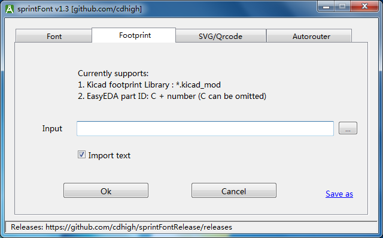
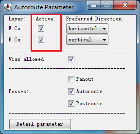
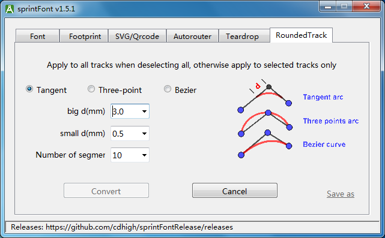

# sprintFont manual
sprintFont is a plugin for Sprint-Layout v6 2022 and newer version.   

## 1. Features
* Write text in other fonts
* Import the footprint from Kicad/EasyEDA
* Insert the SVG image
* Insert Qrcode
* Supports auto-routing
* Add teardrop pads
* Rounded-tracks feature
* Differential pair length matching

## 2. Usage

### 2.1 Install plugin
1. Download [the latest sprintFont package](https://github.com/cdhigh/sprintFontRelease/releases)    

2. Decompress sprintFont to a directory, open Sprint-Layout v6.0 2021 and newer version, click menu ["Extras" / "Define Plugin"]

3. Locate the sprintFont.exe

4. Execute the plugin by clicking menu ["Extras" / "Run Plugin"]

### 2.2 Write text in other fonts

1. Switch to the "Font" page

Choose a font and change some parameters for your application.

2. Return to Sprint-Layout by clicking "OK", the text you entered will be "sticky" on the mouse, move to the desired position and click the mouse to drop it.
If the layer "C2 (Back copper)" or "S2 (Back silkscreen)" is selected, the font is automatically mirrored horizontally.

3. For unicode symbols in font file, you can digit "\u1234" to insert it into Sprint-Layout (replace 1234 with the unicode code of symbol)

### 2.3 Import footprint

Disclaimer: I am not responsible for any loss caused by the incorrect package imported by this plugin. If you do not agree with this disclaimer, please stop using this plugin immediately.

1. **Switch to the "Footprint" page**

2. **Import from Kicad**

Kicad installer is already packaged with a lot of footprint libraries. If you don't want to install Kicad, you can just download the libraries from this link [Kicad official libraries](https://gitlab.com/kicad/libraries/kicad-footprints), in addition, many component search websites also provide footprint library in Kicad format, such as [Component Search Engine](https://componentsearchengine.com).    

**Steps:**    
Click the button on the right side of the text box to select the footprint kicad_mod file in your machine to import to Sprint-Layout. It is compatible with Kicad_v5 and Kicad_v6 format.     

3. **Import from EasyEDA**

**Steps:**    
If you want to import the footprint from EasyEDA, the first thing is to find the LCSC part code of the component, you can go to the website [EasyEDA site](https://easyeda.com/editor), Click the "Library" in the left navigation bar, search and pick the LCSC part code at the bottom of the page     

Digit the LCSC code in the text box, press Enter or click the "Ok" button to import it.    

### 2.4 Insert SVG images/Qrcode

This plugin also supports the importation of SVG vector graphics, but it does not implement all SVG commands internally, so it can only support simple graphics, such as LOGO. 

### 2.5 Autorouting

This plugin successfully added auto-routing functionality to Sprint-Layout.    
The solution is the same as Kicad, divided into three steps:
1. Export the board to Specctra DSN format.   
2. Use the open source auto-router [Freerouting](https://github.com/freerouting/freerouting/releases) to do auto-routing work and save routing results as a SES file.   
3. Import the SES file back to Sprint-Layout.   

#### 2.5.1 Usage

2.5.1.1 **Export to Specctra DSN format**

1. Switch to the layer "O" firstly in Sprint-Layout, and define a closed zone as board boundary, which can be of different shapes such as rectangles, circles or irregular shapes. After that, switch to other board layers to place components and layout them appropriately. Use the "Connections" tool to connect the pins that need to be connected, this connection is called Ratsnest or Airwire or other names in different software.   

2. Deselect all items in Sprint-Layout (no components or tracks can be selected), run the plugin, switch to the "Autorouter" page.   

3. Specify the DSN file name, modify the rule item value by double-clicking the row, and click "Export DSN" to export the DSN file.   
This plugin also generates a pickle file with the same name of DSN file, please do not delete it, this file will be used when importing SES

2.5.1.2 **Auto-routing**

1. [Download and install Freerouting](https://github.com/freerouting/freerouting/releases), open it and load the DSN file.

2. Click "Autorouter" on the toolbar and wait for it to complete the routing. If the circuit board is complex, it may take a long time to run.    

3. The default configuration is for double-sided board, it means both the top and bottom copper layer are allowed to place tracks. If single-sided copper layer is required, you can select the copper layer you need through the Freerouting menu ["Parameter" / "Autoroute"] dialog

4. After the routing is completed, save the result as an SES file via the menu ["File" / "Export Specctra Session File"]

2.5.1.3 **Import SES to Sprint-Layout**

1. Select the correct SES file (ensure that the pickle file with the same name exists), click "Import SES" to directly import the routing result into Sprint-Layout. Sprint-Layout does not necessarily need to pre-open the previous board, it can be a blank board.

2. Hold Shift and click "Import SES" to display a menu with more import options.

* **Import all (remove routed ratsnests)**: It's default behavior when you click "Import SES". The airwires with copper connection are deleted, and the airwires without copper connection are retained.
* **Import all (remove all ratsnests)**: Import all the routing results and components and replace all components on the board, and delete all airwires.
* **Import all (keep all ratsnests)**: Import all the routing results and components and replace all components on the board, and keep all airwires.
* **Import auto-routed tracks only**: Import tracks only, do not import components, do not delete any elements on the circuit board, the imported tracks will "stick" to the mouse, and move to the correct position to drop.

#### 2.5.2 other details for auto-routing
* If there is a .rules file in the same folder of the DSN file, Freerouting will use this file to overwrite the routing rules in the DSN file, so maybe need to delete the .rules file if the result is not what you set in plugin.
* Components can only be placed on the front side. for SMD component, both the component body and the pads are on the front side. for THT component, the component body is on the front side, and the single-sided pad is on the back side, can be any side if is THT (plated) pads. (This is default behavior when you place a component in Sprint-Layout)
* If there are some areas that cannot be routed, you can draw a polygon and set it as "Cutout-area". Or draw it on the layer O (EdgeCuts) can achieve the same effect, but the polygons in the layer O will affect the final circuit board shape.
* If you use the "Disintegrate Component" function to modify the component's pad or silk screen, you have to convert the group back to component again ([right click "Build group" -> right click "Component"]), otherwise Freerouting only displays pads, not silkscreens. (but silkscreens are not lost, they will appear again when be imported into Sprint-Layout)
* Some critical tracks such as power/clock can be prerouted, or modify them manually after Freerouting finished. Auto-routing can be used as the starting point of routing, and can also be used as the end point of routing.
* Due to the limitation(bug?) of Freerouting, silkscreen lines can only be horizontal and vertical or 45-degree. Other angles will be incorrectly drawn in Freerouting, but silkscreen does not affect routing.
* Due to the limitation of Freerouting, the arc of the silk screen is not drawn.
* Sometimes when SES file been imported, the routed net-connections (Ratsnest) have not been deleted. This is a bug of Sprint-Layout. Just create a new blank board and import it again, the problem can be solved.

### 2.6 Teardrop pads

The algorithm of teardrop pads is from <https://github.com/NilujePerchut/kicad_scripts>, thanks in advance.

#### 2.6.1 Basic operation
1. If deselect all elements in Sprint-Layout before executing this plugin, teardrop will be applied to all THT pads. If only some pads need to be added teardrops, you can select the both pads and tracks you need firstly. Deleting teardrops is the same logical, you can delete all teardrops or only those in the selected region.
2. By the legend in the GUI, it should be easier to understand the meaning of the three parameters. The base of the percentage is the outer diameter of the pad.

#### 2.6.2 Details
* thermal pads will not be processed.
* If the teardrop parameters are the same, the teardrop pad will not be added repeatedly. but if the parameters are different, multiple operations may add some overlapping teardrop pads.

### 2.7 Rounded-track
This function can convert ordinary tracks of various angles into rounded tracks, which is very suitable for high-frequency circuits and audio circuits.

#### 2.7.1 Basic operation
1. If deselect all elements in Sprint-Layout before executing this plugin, all tracks will be converted to rounded-tracks if it can be. If only some tracks need to be converted, you can select the tracks you need firstly. 
2. The plugin supports three ways to convert rounded tracks:
    * Tangent arc: The two points at the specified distance from the turning point of the route are the starting point and the end point of the arc, and the arc is tangent to the two segments of the track. There are two distances, if the big one is not suitable for short tracks, the small one will be applied.
    * Three-point arc: The arc is drawn according to every three consecutive points, and the three points are all on the arc.
    * Bezier curve: The first point is the starting point, the third one is the end point, the intersection of the two segments of track is the control point, and a Bezier curve is drawn by these three points.

#### 2.7.2 Details
1. If a track has many turns, the plugin will try to convert it into several arcs every 3 points from the starting point. If some points do not meet the conditions, the plugin will skip them and continue to find a suitable point.
2. The points on the tracks covered by pads or polygons of the same layer are considered as points that do not meet condition of the arc conversion, but you need to select the corresponding pads and polygons at the same time, because the plugin known nothing beside your selection range.

### 2.8 Differential Pair Length Matching  
In high-frequency circuits, maintaining equal lengths for differential pairs is crucial for signal integrity. This feature allows you to add serpentine traces to the shorter line of a differential pair to achieve length matching.  

  

#### 2.8.1 Basic Operation  
1. Select the two differential traces in Sprint-Layout before launching this plugin.  
2. Configure the parameters on the `WirePair` page, then click `Adjust` to open the length matching window.  
3. In the length matching window, the selected traces are displayed. The red line represents the longest trace. Clicking on the green line adds serpentine curves at the clicked position. For single-sided, the curves are placed on the closest side to the mouse click, while double-sided are automatically positioned.  
4. After adding serpentine traces, minor deviations may remain due to arc approximations using multiple segments. First, you can use the "Deviation-" button to try automating the reduction of deviation. If the result is unsatisfactory, you can also use the target skew parameter to adjust the deviation between the actual length and the expected length. The target skew can be either a positive or negative value.

5. Click `Confirm` to exit the matching window, then click `OK` in the main dialog to return to Sprint-Layout.  

  

  

## 3. Others
1. Sprint-Layout communicates with plugins by using temporary file. If no components are selected when launching a plugin, Sprint-Layout will export all components from the PCB to temporary file; otherwise, only the selected components will be exported.    

2. In addition to calling Sprint-Layout through plugin mode, it can also be executed independently. The "OK" button is disabled in independent mode. You can use the "Save As" button to save the generated symbol file to a text file. Then you can use **"Import: Text Design Format File"** menu item to import it.   

3. The software supports both Chinese and English interfaces, automatically detecting the system language at startup. If manual switching is required, you can modify it in the config.json file ("language":"en/zh-ch/de/es/pt/fr/ru/tr").   

4. If the plug-in cannot be loaded, please download and install the VC runtime library 2015/2017/2019/2022 (any one). If it still does not work, you may also need "Universal C Runtime for Windows". You can search it for links, or just use links below:    
* [VC runtime x86](https://aka.ms/vs/17/release/vc_redist.x86.exe)
* [VC runtime x64](https://aka.ms/vs/17/release/vc_redist.x64.exe)
* [Universal C Runtime](https://support.microsoft.com/en-us/topic/update-for-universal-c-runtime-in-windows-c0514201-7fe6-95a3-b0a5-287930f3560c)

5. About false positives of some antivirus softwares, since this program is developed using Python and then packaged into exe, this packaging mechanism may easily trigger false positives in some particularly sensitive antivirus software. If you have doubts, you can upload the file to [VirusTotal](https://www.virustotal.com/) or similar websites for virus scanning, or install Python yourself and directly execute the source code.    

## 4. Changelog
### v1.7
* New feature: differential pair length matching

### v1.6.1
* Added automatic translations using AI, including German, French, Spanish, Portuguese, Russian, and Turkish.

### v1.6
* 1. New feature: invert font background (negative image).
* 2. Bugfix: layout issue when word-spacing and line-spacing have positive values.

### v1.5.5
* Supports teardrop feature for SMD pads (experimental).

### v1.5.4
* Supports Kicad footprint version 7/8.
* Add font preview functionality.
* Display more error information when importing Kicad_mod files fails.

### v1.5.3
* fixed a name attribute error when importing footprint from EasyEDA
* Compile a release package that supports Windows XP

### v1.5.2
* Add name property for all elements (ready for Sprint-Layout 08.07.2022)
* support user fonts in Windows10
* fix render problem for kaiti_GB2312

### v1.5.1
* Rounded-tracks has two distances, if the big one is not suitable, the small one will be applied

### v1.5
* Convert tracks to Rounded-tracks

### v1.4
* Added teardrop pads

### v1.3
* Added auto-routing (use Freerouting as auto-router)
* Added support for ttc/otc font format
* Some minor optimizations

### v1.2
* Insert Qrcode

### v1.1
* Import footprint from Kicad/EasyEDA
* Insert svg image

### v1.0
* Insert text in other fonts into Sprint-Layout

